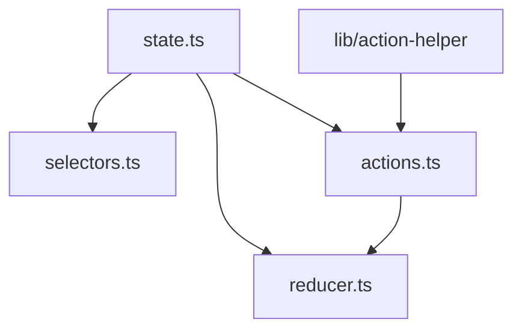

This is project overview

LLM model updates below content when needed for future references

## Whenever the user ask question and LLM changes something in the content, below content will be updated by LLM

# Project Structure Analysis

## Core Module (`src/core/`)

The core module implements Redux state management with TypeScript:

1. **State Management Files**:

   - `state.ts`: Defines state structure (count: number)
   - `actions.ts`: Defines UI and effect actions using custom helper
   - `reducer.ts`: Handles state updates for increment/decrement
   - `selectors.ts`: Provides state access functions

2. **Dependencies**:

   - `state.ts` is the foundation (no dependencies)
   - Other files depend on `state.ts`
   - `actions.ts` uses `@/lib/action-helper`
   - No circular dependencies

3. **Core Module Relationships**:



## Shell Module (`src/shell/`)

The shell module handles store configuration and middleware:

1. **Store Configuration**:

   - `store.ts`: Central Redux store configuration
   - `storeHooks.ts`: React-Redux integration hooks
   - `effects.ts`: Utility functions for async operations

2. **Middleware** (`shell/middleware/`):

   - `counterMiddleware.ts`: Handles async increment logic
   - `loggingMiddleware.ts`: Action logging

3. **Key Dependencies**:

   - Most dependencies flow through `store.ts`
   - Core module is imported but never imports from shell
   - Type-safe implementation with TypeScript

4. **Shell Module Relationships**:

```mermaid
graph TD
    A[store.ts] --> B[middleware/counterMiddleware.ts]
    A --> C[middleware/loggingMiddleware.ts]
    A --> D[@/core/reducer]
    A --> E[@/core/state]
    A --> F[@/core/actions]

    G[storeHooks.ts] --> H[@/core/selectors]
    G --> A

    B --> I[effects.ts]
    B --> F
    B --> A

    C --> A
```

## Data Flow

```
Action → LoggerMiddleware → CounterMiddleware → Reducer → State → Selectors → React Components
```

## Architecture Highlights

- Clean separation of concerns
- No circular dependencies
- Type-safe Redux implementation
- Isolated side effects
- Middleware for async operations
- DevTools integration for debugging

## Key Relationship Patterns

1. **Dependency Flow:**

   - Core module files depend primarily on `state.ts`
   - Shell module files center around `store.ts`
   - Core module is imported by shell but never imports from shell

2. **Type Safety Chain:**

   - `store.ts` defines key types (AppDispatch, AppMiddleware)
   - These types are used throughout the shell directory
   - Ensures type consistency across the application

3. **Clean Architecture:**
   - Clear separation between core state management and shell configuration
   - Middleware isolates side effects
   - Hooks provide clean React integration
   - No circular dependencies in either module

# Todo Application Implementation Plan

## Core Module Changes

1. **State Structure** (`state.ts`):

```typescript
export type Todo = {
  id: string;
  text: string;
  completed: boolean;
  createdAt: number;
};

export type State = {
  todos: Todo[];
  filter: 'all' | 'active' | 'completed';
};
```

2. **Actions** (`actions.ts`):

```typescript
const actions = {
  ['todo/add']: actionDef<{ text: string }>(),
  ['todo/toggle']: actionDef<{ id: string }>(),
  ['todo/remove']: actionDef<{ id: string }>(),
  ['todo/edit']: actionDef<{ id: string; text: string }>(),
  ['todo/clear-completed']: actionDef<null>(),
  ['filter/set']: actionDef<{ filter: State['filter'] }>(),
  ['todo/add-async']: actionDef<{ text: string }>(),
  ['eff/todo-add-ready']: actionDef<Todo>(),
};
```

3. **Selectors** (`selectors.ts`):

```typescript
export const selectTodos = (state: State) => state.todos;
export const selectFilter = (state: State) => state.filter;
export const selectFilteredTodos = (state: State) => {
  const todos = selectTodos(state);
  const filter = selectFilter(state);

  switch (filter) {
    case 'active':
      return todos.filter((todo) => !todo.completed);
    case 'completed':
      return todos.filter((todo) => todo.completed);
    default:
      return todos;
  }
};
```

## Shell Module Changes

1. **Middleware** (`middleware/todoMiddleware.ts`):

```typescript
export const todoMiddleware: AppMiddleware =
  (store) => (next) => async (action) => {
    if (!isAppAction(action)) {
      return next(action);
    }

    const result = next(action);

    if (action.type === AT['todo/add-async']) {
      await delay(1000); // Simulate API call
      const newTodo: Todo = {
        id: crypto.randomUUID(),
        text: action.payload.text,
        completed: false,
        createdAt: Date.now(),
      };
      store.dispatch(AC['eff/todo-add-ready'](newTodo));
    }

    return result;
  };
```

2. **Store Hooks** (`storeHooks.ts`):

```typescript
export const useTodos = () => useSelector(selectFilteredTodos, shallowEqual);
export const useFilter = () => useSelector(selectFilter, shallowEqual);
```

## View Module Additions

1. **Components**:

   - `TodoList.tsx`: Main list component
   - `TodoItem.tsx`: Individual todo item
   - `TodoInput.tsx`: New todo input
   - `TodoFilter.tsx`: Filter controls
   - `TodoStats.tsx`: Statistics display

2. **Layout**:
   - Modern, clean UI with Tailwind CSS
   - Responsive design
   - Animations for todo operations

## Implementation Steps

1. Update core state management
2. Add todo middleware for async operations
3. Create UI components
4. Add persistence middleware (optional)
5. Implement filtering and sorting
6. Add animations and transitions

This implementation will maintain the same clean architecture and type safety of the current project while expanding it to handle todos.
